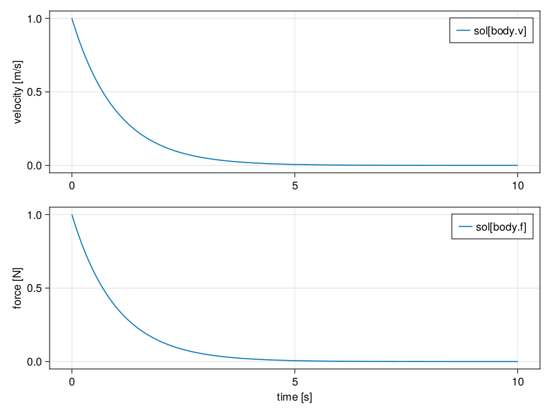
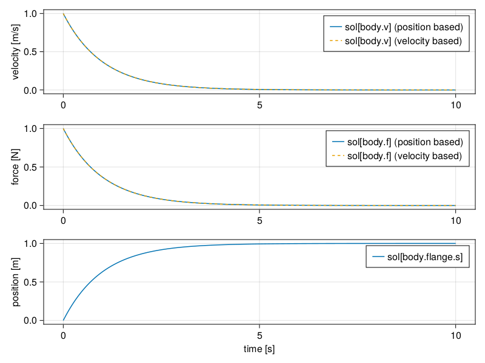

# Introduction
In Physical Network Acausal modeling each physical domain must define a **connector** to combine model components.  This is somewhat analogus to real life connections that are seen in electronics (i.e. battery connected to a wire) or fluid dynamics (i.e. pump connected to a pipe), to name a couple examples.  Each physical domain **connector** defines a minimum of 2 variables, one which is called a *Through* variable, and one which is called an *Across* variable.  Both Modelica and SimScape define these variables in the same way:

- [Modelica Connectors](https://mbe.modelica.university/components/connectors/#acausal-connection)
- [SimScape Connectors](https://www.mathworks.com/help/simscape/ug/basic-principles-of-modeling-physical-networks.html#bq89sba-6)

However, the standard libraries differ on the selection of the Across variable for the Mechanical Translation and Rotation libraries, Modelica choosing position and angle and SimScape choosing velocity and angular velocity, respectively for Translation and Rotation.  Modelica describes their decision [here](https://mbe.modelica.university/components/connectors/simple_domains/).  In summary they would like to provide less integration in the model to avoid lossy numerical behavior, but this decision assumes the lowest order derivative is needed by the model.  Numerically it is possible to define the connector either way, but there are some consequences to this decision, and therefore we will study them in detail here as they relate to ModelingToolkit.  

# Through and Across Variable Theory
### General
The idea behind the selection of the **through** variable is that it should be a time derivative of some conserved quantity. The conserved quantity should be expressed by the **across** variable.  In general terms the physical system is given by

- Energy Dissipation: $ \partial \color{blue}{across} / \partial t \cdot c_1 = \color{green}{through} $
- Flow: $ \color{green}{through} \cdot c_2 = \color{blue}{across} $

### Electrical
So for the Electrical domain the across variable is *voltage* and the through variable *current*.  Therefore 

- Energy Dissipation: $ \partial \color{blue}{voltage} / \partial t \cdot capacitance = \color{green}{current} $
- Flow: $ \color{green}{current} \cdot resistance = \color{blue}{voltage} $

### Translational
And for the translation domain, choosing *velocity* for the across variable and *force* for the through gives

- Energy Dissipation: $ \partial \color{blue}{velocity} / \partial t \cdot mass = \color{green}{force} $
- Flow: $ \color{green}{force} \cdot (1/damping) = \color{blue}{velocity} $

The diagram here shows the similarity of problems in different physical domains.  


# Electrical Domain Example
We can generate the above relationship with ModelingToolkit and the ModelingToolkitStandardLibrary using 3 blocks:

- Capacitor: for energy storage with initial voltage = 1V
- Resistor: for energy flow
- Ground: for energy sink

As can be seen, this will give a 1 equation model matching our energy dissipation relationship

```julia
using ModelingToolkitStandardLibrary
using ModelingToolkitStandardLibrary.Electrical, ModelingToolkit, OrdinaryDiffEq
using CairoMakie

@parameters t

@named resistor = Resistor(R = 1)
@named capacitor = Capacitor(C = 1)
@named ground = Ground()

eqs = [
    connect(capacitor.n, resistor.p)
    connect(resistor.n, ground.g, capacitor.p)
    ]

@named model = ODESystem(eqs, t; systems=[resistor, capacitor, ground])

sys = structural_simplify(model)

equations(sys)
```

```
1-element Vector{Equation}:
 Differential(t)(capacitor₊v(t)) ~ capacitor₊i(t) / capacitor₊C
```


The solution shows what we would expect, a non-linear disipation of voltage and releated decrease in current flow...

```julia
prob = ODEProblem(sys, [1.0], (0, 10.0), [])
sol = solve(prob, ImplicitMidpoint(); dt=0.01)

fig = Figure()
ax = Axis(fig[1,1], ylabel="voltage [V]")
lines!(ax, sol.t, sol[capacitor.v], label="sol[capacitor.v]")
axislegend(ax)

ax = Axis(fig[2,1], xlabel="time [s]", ylabel="current [A]")
lines!(ax, sol.t, -sol[resistor.i], label="sol[resistor.i]")
axislegend(ax)

fig
```


# Translational Domain Example (Across Variable = velocity)
Now using the Translational library based on velocity, we can see the same relationship with a system reduced to a single equation, using the components:

- Body (i.e. moving mass): for kinetic energy storage with an initial velocity = 1m/s
- Damper: for energy flow
- Fixed: for energy sink

```julia
module TranslationalVelocity
    using ModelingToolkit
    using ModelingToolkitStandardLibrary.Mechanical.Translational

    @parameters t

    @named damping = Damper(d = 1)
    @named body = Body(m = 1, v0=1)
    @named ground = Fixed()

    eqs = [
        connect(damping.port_a, body.port)
        connect(ground.port, damping.port_b)
        ]

    @named model = ODESystem(eqs, t; systems=[damping, body, ground])

    sys = structural_simplify(model)
end

sys = TranslationalVelocity.sys
full_equations(sys)
```

```
1-element Vector{Equation}:
 Differential(t)(body₊v(t)) ~ (-damping₊d*body₊v(t)) / body₊m
```


As expected we have a similar solution...
```julia
prob = ODEProblem(sys, [1.0], (0, 10.0), [])
sol_v = solve(prob, ImplicitMidpoint(); dt=0.01)

fig = Figure()
ax = Axis(fig[1,1], ylabel="velocity [m/s]")
lines!(ax, sol_v.t, sol_v[TranslationalVelocity.body.v], label="sol[body.v]")
axislegend(ax)

ax = Axis(fig[2,1], xlabel="time [s]", ylabel="force [N]")
lines!(ax, sol_v.t, -sol_v[TranslationalVelocity.body.f], label="sol[body.f]")
axislegend(ax)

fig
```




# Translational Domain Example (Across Variable = position)

Now, let's consider the position based approach.  We can build the same model with the same components.  As can be seen, we now end of up with 2 equations, because we need to relate the lower derivative (position) to force (with acceleration).  

```julia
module TranslationalPosition
    using ModelingToolkit
    using ModelingToolkitStandardLibrary.Mechanical.TranslationalPosition

    @parameters t
    D = Differential(t)

    # Let's define a simple body that only tracks the across and through variables...
    function Body(; name, m, v0 = 0.0)
        @named flange = Flange()
        pars = @parameters m=m v0=v0
        vars = @variables begin
            v(t) = v0
            f(t) = m*v0
        end
        eqs = [
            D(flange.s) ~ v
            flange.f ~ f

            D(v) ~ f/m
            ]
        return compose(ODESystem(eqs, t, vars, pars; name = name), flange)
    end

    @named damping = Damper(d = 1)
    @named body = Body(m = 1, v0=1)
    @named ground = Fixed()

    eqs = [
        connect(damping.flange_a, body.flange)
        connect(ground.flange, damping.flange_b)
        ]

    @named model = ODESystem(eqs, t; systems=[damping, body, ground])

    sys = structural_simplify(model)
end

sys = TranslationalPosition.sys

full_equations(sys)
```

```
2-element Vector{Equation}:
 Differential(t)(body₊flange₊s(t)) ~ body₊v(t)
 Differential(t)(body₊v(t)) ~ -((damping₊d*body₊v(t)) / body₊m)
```


As can be seen, we get exactly the same result.  The only difference here is that we are solving an extra equation, which allows us to plot the body position as well.

```julia
prob = ODEProblem(sys, [0.0, 1.0], (0, 10.0), [])
sol_p = solve(prob, ImplicitMidpoint(); dt=0.01)

fig = Figure()
ax = Axis(fig[1,1], ylabel="velocity [m/s]")
lines!(ax, sol_p.t, sol_p[TranslationalPosition.body.v], label="sol[body.v] (position based)")
lines!(ax, sol_v.t, sol_v[TranslationalVelocity.body.v], label="sol[body.v] (velocity based)", linestyle=:dash)
axislegend(ax)

ax = Axis(fig[2,1], ylabel="force [N]")
lines!(ax, sol_p.t, -sol_p[TranslationalVelocity.body.f], label="sol[body.f] (position based)")
lines!(ax, sol_v.t, -sol_v[TranslationalVelocity.body.f], label="sol[body.f] (velocity based)", linestyle=:dash)
axislegend(ax)

ax = Axis(fig[3,1], xlabel="time [s]", ylabel="position [m]")
lines!(ax, sol_p.t, sol_p[TranslationalPosition.body.flange.s], label="sol[body.flange.s]")
axislegend(ax)

fig
```


