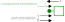
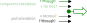
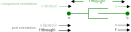

# Sign Convention

A sign convention is recommended for this library that implements the following rule:

> An input component that specifies the *through* variable should be such that a positive equality is written.

For example, the following would be the *correct* sign convention for the `Mechanical.Translational` force variable `f`

```julia
@mtkmodel ConstantForce begin
    @parameters begin
        f = 0
    end
    @components begin
        flange = MechanicalPort()
    end
    @equations begin
        # connectors
        flange.f ~ f
    end
end
```

And writing the following would be the *incorrect* sign convention.

```julia
@equations begin
    # connectors
    flange.f ~ -f # <-- wrong through variable input sign!
end
```

To visualize the sign convention, one can draw the orientation of the connector port *across* and *through* variables and the subsequent component variables.  For example, the `Mechanical.Translation` mass component would look like



In this case we know from Newton that mass times acceleration equals force, therefore the direction of movement is in the opposite direction of the force.  In other words, if we push the mass from left to right (i.e. in the positive direction), then the mass will generate a force in the negative direction.  This would be the general rule for a single port component of any domain.  The exception is for a *through* variable **input** component, which should align the component and port connection *through* variables.  For example, a force input diagram would look like this:



For a 2 port connection component, then the *through* variable is exiting each connection port in opposing directions.  Using a damper as an example, if the positive direction is to the right, then the force of the damper is pushing left (i.e. in the negative direction) on connection port `a` and right (positive direction) on connection port `b`.



# Discussion

The energy disipation equation that governs the acausal connection definitions should be such that a positive *through* variable input will lead to an increasing *across* variable value.

```math
\frac{\partial \blue across}{\partial t} = \text{ {\green through} input}
```

This is demonstrated in the following domains of `Mechanical`, `Electrical`, and `Hydraulic`.

## Mechanical

Here we can see that a positive input force results in an increasing velocity.

```@example sign_convention
using ModelingToolkit
using ModelingToolkitStandardLibrary.Mechanical.Translational

@parameters t
D = Differential(t)

@mtkmodel System begin
    @components begin
        mass = Mass(; m = 10)
        force = ConstantForce()
    end
    @equations begin
        connect(mass.flange, force.flange)
    end
end
@mtkbuild sys = System()
full_equations(sys)
```

## Electrical

Here we can see that a positive input current results in an increasing voltage. Note that the electrical domain uses pins `p` and `n` at each side of the source and energy storage components.  The direction of connection is not important here, only that a positive connector `p` connects with a negative connector `n`.

```@example sign_convention
using ModelingToolkitStandardLibrary.Electrical

@mtkmodel System begin
    @components begin
        capacitor = Capacitor(; C = 10)
        current = ConstantCurrent()
        ground = Ground()
    end
    @equations begin
        connect(current.p, capacitor.n)
        connect(capacitor.p, current.n, ground.g)
    end
end
@mtkbuild sys = System()
full_equations(sys)
```

Reversing the pins gives the same result

```@example sign_convention
@mtkmodel System begin
    @components begin
        capacitor = Capacitor(; C = 10)
        current = ConstantCurrent()
        ground = Ground()
    end
    @equations begin
        connect(current.n, capacitor.p)
        connect(capacitor.n, current.p, ground.g)
    end
end
@mtkbuild sys = System()
full_equations(sys)
```

## Hydraulic

A positive input mass flow leads to an increasing pressure (in this case we get increasing density (`rho`), which is directly related to an increasing pressure).

```@example sign_convention
using ModelingToolkitStandardLibrary.Hydraulic.IsothermalCompressible

@mtkmodel System begin
    @components begin
        volume = FixedVolume(; vol = 10.0, p_int = 0.0)
        flow = ConstantMassFlow()
        fluid = HydraulicFluid()
    end
    @equations begin
        connect(flow.port, volume.port)
        connect(fluid, flow.port)
    end
end
@mtkbuild sys = System()
full_equations(sys) |> first
```
